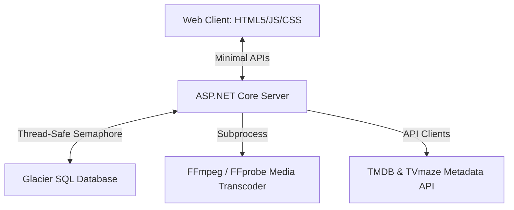

# Project Amity 🦈

> *Amity: A nod to Jaws—a localized environment with plenty of action under the surface.*

Project Amity is a lightweight, localized media server and web client designed to catalog, index, and stream your personal movies and TV shows. Built on a robust .NET 10 backend and featuring a highly interactive, keyboard-navigable HTML5 frontend, Amity brings a premium, Plex-like cinematic dashboard directly to your local network.

---

## 🌟 Key Features

### 🎬 Sleek Cinematic Web Client
* **Dynamic Grid Layouts**: Fully responsive flex grids that automatically rearrange posters based on screen size.
* **Thumbnail Size Resizer Slider**: Adjust thumbnail dimensions dynamically from 110px to 240px across all dashboard views.
* **Ambient Glow Aesthetics**: Dark-mode glassmorphism theme styled with curated Outfit typography, smooth CSS transitions, and high-contrast focus rings.

### ⚙️ Standalone Keyboard & D-pad Navigation Engine
* **2D Distance Focusing**: Fully functional keyboard and D-pad control loop (`ArrowUp`, `ArrowDown`, `ArrowLeft`, `ArrowRight`, `Enter`, `Escape`, `Backspace`). Focus hops geometrically to the closest screen coordinate.
* **Focus Isolation Overlays**: Focus automatically traps within modals (Settings, Metadata Editor, About, Player) and returns to the originating item upon closing.
* **Accessibility Compliant**: Eliminates duplicate click events on native buttons and delays scans until browser reflow completes.

### ⏱️ Continue Watching & Watch Status Tracking
* **Server-Side Duration Extraction**: Scans video headers on startup using `ffprobe` to save media length. Works around browser transcoding limitations to ensure resume features work on live Fragmented MP4 streams.
* **Heartbeat Progress Tracking**: Sends resume checkpoints to the database during playback.
* **Mark Played/Unplayed**: Circular icons toggled dynamically to track watched states on movies, seasons, or individual episodes.

### 📁 Advanced Library Management
* **Auto-Directory Scanner**: Recursively scans folders, parses titles and years, and resolves nested TV season/episode indexes.
* **Self-Healing Folder Mapping**: Scanner tracks existing database mappings for TV series directories, ensuring that manually matched or renamed TV Shows do not result in duplicate series records during directory scans.
* **Aggressive Empty Show Cleanup**: Automatically identifies and prunes TV Show catalog entries with zero episodes from the database index.
* **Dynamic Scrapers**: Hydrates database items with overview summaries, genres, director lists, cast circles, and poster artwork using TMDB and TVmaze APIs.
* **Fix Match & Metadata Editor**: Manually search and match wrong metadata by querying external TVmaze/TMDb identifiers, or directly override metadata values.
* **Custom Playlists**: Create, rename, delete, and manually reorder playlist entries via interactive up/down sliders.
* **Shuffle & Sort**: Sort libraries by Title, Release Year, Date Added, or Last Played. Toggle instant library shuffle.

---

## 🛠️ Architecture & Tech Stack



* **Frontend**: Vanilla HTML5, Custom CSS Variables, Bootstrap 5 utilities, and native Javascript (no heavy frameworks).
* **Backend**: ASP.NET Core Minimal APIs (.NET 10).
* **Database**: Glacier SQL Engine (featuring serializable semaphore guards to prevent directory scanner lockups).
* **Transcoder**: FFmpeg (fragmented stream pipes) and FFprobe (specs/duration parsing).

---

## 🚀 Getting Started

### Prerequisites
* **.NET 10 SDK** (Installed on host machine)
* **FFmpeg / FFprobe** binaries added to your system environment variables `PATH`.

### Installation
1. Clone the repository:
   ```bash
   git clone https://github.com/ian-cowley/ProjectAmity.git
   cd ProjectAmity
   ```
2. Build the solution:
   ```bash
   dotnet build src/ProjectAmityServer/ProjectAmityServer.csproj
   ```

### Running the Server
Launch the backend server:
```bash
dotnet run --project src/ProjectAmityServer/ProjectAmityServer.csproj
```
The server will boot, initialize the local database files at `C:\Users\<username>\AppData\Roaming\ProjectAmity\Database`, run a startup library scanner scan, and begin listening on:
- **`http://localhost:5279`**

Open this address in any modern web browser to access the Amity Dashboard!

---

## 📡 API Endpoints Reference

### Media Library
* `GET /api/media` - Get list of movies/episodes (optional filter: `mediaType`).
* `GET /api/media/continue-watching` - Get active, partially-watched media sorted by last played.
* `GET /api/media/{id}` - Get detailed specs and scraped metadata of a single media item.
* `DELETE /api/media/{id}` - Manually remove a media item (movie or episode) from the library index.
* `POST /api/media/{id}/resume` - Save client progress heartbeat (resume position in seconds).
* `POST /api/media/{id}/duration` - Save total runtime duration.
* `POST /api/media/{id}/watched` / `unwatched` - Mark item played/unplayed.

### TV Shows
* `GET /api/tvshows` - Get list of TV shows.
* `GET /api/tvshows/{showId}/episodes` - Get all episodes for a specific series.
* `DELETE /api/tvshows/{id}` - Manually remove a TV series (and all its episodes) from the library index.
* `POST /api/tvshows/{showId}/watched` / `unwatched` - Mark a whole series as played/unplayed.

### Metadata Operations
* `GET /api/metadata/search` - Search metadata candidates on TMDB or TVmaze.
* `POST /api/metadata/match` - Match a local library item to an external media provider ID.

### Collections & Playlists
* `GET /api/collections` - Get list of collections.
* `GET /api/playlists` - Get custom playlists.
* `POST /api/playlists` - Create a new playlist.
* `DELETE /api/playlists/{id}` - Delete a playlist.
* `GET /api/playlists/{id}/items` - Get playlist elements.
* `POST /api/playlists/{id}/items` - Add media item to playlist.

---

## 👥 Credits
Developed by Ian Cowley and Antigravity (Google DeepMind).

---

## 📄 License
This project is licensed under the **MIT License**. See the [LICENSE](LICENSE) file for details.
